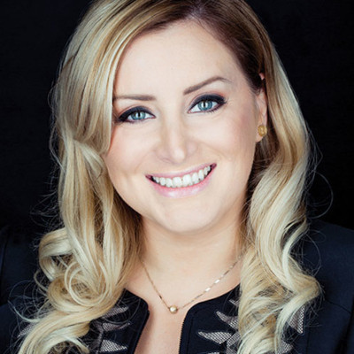

<!DOCTYPE html>
<html lang="fr-ca">

<head>
    <meta charset="UTF-8">
    <meta http-equiv="X-UA-Compatible" content="IE=edge">
    <meta name="viewport" content="width=device-width, initial-scale=1.0">
    <link rel="stylesheet" href="./css/style.css" />
    <link rel="stylesheet" href="https://fonts.googleapis.com/css?family=Oswald|Noto+Sans">
    <link rel="stylesheet" href="https://use.fontawesome.com/releases/v5.8.1/css/all.css">
    <title>Myriapode-accueil</title>
    <link rel="icon" type="image/x-icon" href="./images/favicon.png">
</head>

<body id="accueil">
    <main class="accueilflex">
        <header>
            
        </header>
        <nav>
            <ul>
                <li><a href="./accueil.html">Accueil</a></li>
                <li><a href="./equipe.html">Équipe</a></li>
                <li><a href="./contact.html">Contact</a></li>
            </ul>
        </nav>
        <section class="titreflex">
            <h1>| AGENCE WEB | </h1>
            <h2>Services</h2>
        </section>
        

            <section class="fond-service1">
                

                    <h3> Design web sur mesure </h3>
                    
Soyez assurez d'avoir un site adapté à tous les appareils!
                        Nous sommes fiers de créer des sites adaptatifs, c'est à dire
                        qu'ils s'adaptent à tous les formats et appareils.
                        Nous concevons le design de votre site pour qu'il reflète l'image de votre entreprise.

                

            </section>
            <section class="fond-service2">
                

                    <h3>Boutique en ligne</h3>
                    
Vous voulez vendre vos produits ou service en ligne?
                        Nous avons une solution pour tous les projets, qu'ils soient grands ou petits.
                        Nos sites sont sécurisés et simple d'utilisation
                        pour que l'expérience d'achat de vos clients soient optimale. 

                

            </section>
            <section class="fond-service3">
                

                    <h3>SEO référencement naturel</h3>
                    
 Vous désirez améliorer votre positionnement sur Google et les autres moteurs de recherche ?
                        Nous pouvons vous aider via:  L’optimisation pour moteurs de recherche (SEO)
                         Le référencement local : Google, Bing, Yahoo…
                         La rédaction Web
                    

                

            </section>
            <section class="fond-service4">
                

                    <h3>Marketing par courriel</h3>
                    
<strong>Fini les appels téléphoniques!! </strong> Le marketing par courriel est un outil
                        puissant quand il est bien utilisé!
                        Le marketing par courriel fait grandir la relation entre vous et vos clients.

                        Nous vous aidons à batir votre marketing automatisé
                        pour rejoindre votre client au bon moment avec le bon message!

                

            </section>
        

        <section class="avis">
            <h3 class="bordure">Ce qu'en pensent nos clients:</h3>
            <article>
                

                    
                    

                        <h3>Serge Beauchemin, fondateur de 3-SOFT </h3>
                        
                        
                        
                        
                        
                    

                    
Une équipe exceptionnelle qui a su comprendre mes besoins!
                        Les services sont un peu plus chers que le 40$ que j'ai investi dans mon entreprise
                        mais j'ai rentabilisé mon achat en un rien de temps!!

                

            </article>
            <article>
                

                    
                    

                        <h3>Caroline Arnouk, fondatrice de Technologies OPA</h3>
                        
                        
                        
                        
                        
                    

                    
 Avec Myriapode mon entreprise s'est rendu du point a au point b sans embuches!
                        Et le trafic de mon site a plus que doublé en peu de temps.

                

            </article>
        </section>
    </main>
    <footer>
        
&copy;2021 Annabelle Nicole

    </footer>

</body>

</html>
